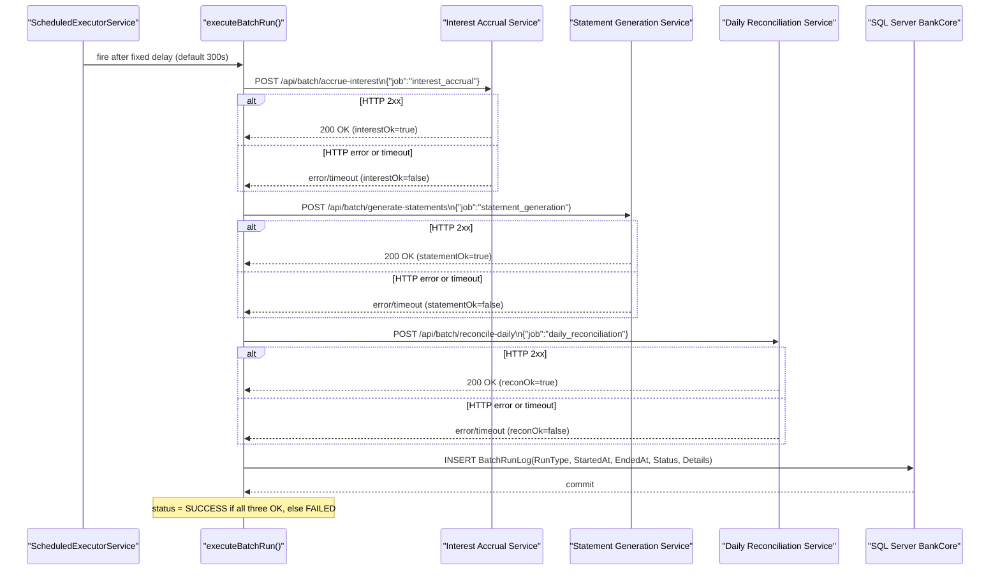

# API & Service Communication Contracts

ZavaBatchScheduler is a headless background service with no inbound API surface; it exposes no HTTP endpoints of its own and acts solely as an HTTP client, making three outbound POST calls to downstream financial microservices on each scheduled batch run.

## Service Catalog

| Service | Port | Category | Purpose |
|---------|------|----------|---------|
| ZavaBatchScheduler | N/A (no inbound port) | Business | Scheduled batch runner — triggers interest accrual, statement generation, and reconciliation |
| Interest Accrual Service | 8080 | Business | External — accrues interest on accounts |
| Statement Generation Service | 8080 | Business | External — generates account statements |
| Daily Reconciliation Service | 8080 | Business | External — reconciles ledger entries daily |

## API Endpoints Inventory

ZavaBatchScheduler exposes **no inbound HTTP endpoints**. The service does not start an HTTP server; there are no REST controllers, JAX-RS resources, or Servlet mappings.

Outbound calls made by this service:

| Called Service | Method | Path | Request Payload | Expected Response |
|----------------|--------|------|-----------------|-------------------|
| Interest Accrual Service | POST | `/api/batch/accrue-interest` | `{"job":"interest_accrual"}` | HTTP 2xx = success |
| Statement Generation Service | POST | `/api/batch/generate-statements` | `{"job":"statement_generation"}` | HTTP 2xx = success |
| Daily Reconciliation Service | POST | `/api/batch/reconcile-daily` | `{"job":"daily_reconciliation"}` | HTTP 2xx = success |

## Management & Observability Endpoints

| Service | Endpoint | Custom Metrics |
|---------|----------|----------------|
| ZavaBatchScheduler | None | None — no HTTP server, no actuator, no Prometheus exporter |

> Note: There are no health check, liveness, or readiness endpoints. Container orchestrators (AKS, Azure Container Apps) cannot probe the application's health.

## DTOs & Contracts

The application uses no formal DTO or contract classes. All outbound request payloads are hard-coded JSON string literals passed directly to `callService()`:

- `{"job":"interest_accrual"}`
- `{"job":"statement_generation"}`
- `{"job":"daily_reconciliation"}`

Response bodies are read as raw strings for logging purposes only; no deserialization or contract validation is performed. There are no OpenAPI/Swagger specifications, protobuf schemas, or GraphQL schemas. Jackson or any JSON serialization library is absent — the application uses plain string literals.

## Communication Patterns

**Synchronous HTTP (blocking):** All outbound calls use `java.net.HttpURLConnection` in blocking mode. The three service calls within each batch run are made sequentially — if one call hangs for the full timeout duration, the subsequent calls are delayed accordingly.

**Timeouts:** Both connect timeout and read timeout are set to the value of `http.timeout.ms` (default 15 000 ms / 15 s). There is a single shared timeout for all three service calls.

**No resilience patterns:** There is no circuit breaker, retry policy, bulkhead, or fallback logic. A transient HTTP failure immediately marks the corresponding job as `false` (failed) for the current batch run without any retry attempt. The overall batch status is `FAILED` if any of the three calls fails.

**No service discovery:** Service URLs are resolved from `batchscheduler.properties` at startup. Hostnames use Docker Compose internal DNS (`zavainterestcalculator`, `zavastatementservice`, `zavaledger`). There is no Eureka, Consul, or Kubernetes DNS-based discovery.

**No API gateway:** The scheduler calls downstream services directly without any intermediary gateway or proxy.

**No load balancing:** Each call goes to a single hard-coded URL with no client-side or server-side load balancing.

**Security posture:** No authentication or TLS is configured. All outbound calls use the `http://` scheme with no `Authorization` header. All inter-service traffic is publicly accessible with no authorization checks. Credentials (database password) are stored as plain text in `batchscheduler.properties` and loaded at runtime. There is no HTTPS enforcement, no mutual TLS, and no token-based authentication for the outbound service calls.

## Service Technology Matrix

| Service | Web | Data Access | Discovery | Gateway | Actuator | Cache | Metrics |
|---------|-----|-------------|-----------|---------|----------|-------|---------|
| ZavaBatchScheduler | None | JDBC (mssql-jdbc) | None (static URLs) | None | None | None | None |

## Service Communication Sequence

