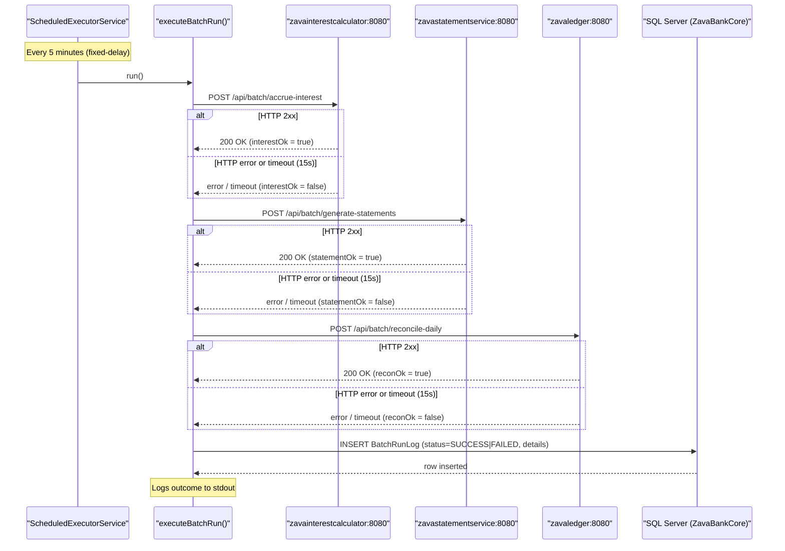

# API & Service Communication Contracts

ZavaBatchScheduler exposes no inbound API surface of its own; it is a pure HTTP client that drives three downstream banking microservices on a fixed schedule and has no REST endpoints, management endpoints, or message-broker consumers.

## Service Catalog

| Service | Port | Category | Purpose |
|---------|------|----------|---------|
| ZavaBatchScheduler | — (no inbound port) | Business | Scheduled batch orchestrator: calls downstream services and persists run results |
| zavainterestcalculator | 8080 | Business | Applies overnight interest accrual for customer accounts |
| zavastatementservice | 8080 | Business | Generates periodic account statements |
| zavaledger | 8080 | Business | Performs daily ledger reconciliation |
| SQL Server (ZavaBankCore) | 1433 | Infrastructure | Relational store for batch run audit log (`BatchRunLog`) |

## API Endpoints Inventory

ZavaBatchScheduler itself does **not** expose any inbound HTTP endpoints. The table below documents the outbound endpoints it calls on downstream services.

| Caller | Method | Path | Request Type | Response Type |
|--------|--------|------|-------------|--------------|
| ZavaBatchScheduler → zavainterestcalculator | POST | `/api/batch/accrue-interest` | JSON string `{"job":"interest_accrual"}` | HTTP 2xx = success |
| ZavaBatchScheduler → zavastatementservice | POST | `/api/batch/generate-statements` | JSON string `{"job":"statement_generation"}` | HTTP 2xx = success |
| ZavaBatchScheduler → zavaledger | POST | `/api/batch/reconcile-daily` | JSON string `{"job":"daily_reconciliation"}` | HTTP 2xx = success |

## Management & Observability Endpoints

| Service | Endpoint | Custom Metrics |
|---------|----------|---------------|
| ZavaBatchScheduler | None | None — no Actuator, health check, or metrics endpoint exposed |
| Downstream services | Unknown (source not in this repository) | Unknown |

> **Note:** ZavaBatchScheduler has no health check, readiness probe, or metrics endpoint. Observability is limited to stdout log lines written via `System.out.println`.

## DTOs & Contracts

No formal DTO or contract classes are defined. All outbound request payloads are hand-crafted JSON string literals passed directly to `callService()`:

- `{"job":"interest_accrual"}` — sent to the interest accrual endpoint
- `{"job":"statement_generation"}` — sent to the statement generation endpoint
- `{"job":"daily_reconciliation"}` — sent to the daily reconciliation endpoint

Response bodies are read as raw strings and logged; no deserialization into model objects occurs. There are no OpenAPI/Swagger specifications, protobuf schemas, or GraphQL schemas present. There is no Jackson or other JSON serialization library configured — responses are consumed as opaque text.

## Communication Patterns

**Synchronous HTTP (blocking):** All three downstream service calls are made synchronously using `java.net.HttpURLConnection` with configurable connect and read timeouts (default 15 000 ms each, overridable via `http.timeout.ms`). The scheduler invokes all three calls sequentially within a single `executeBatchRun()` invocation before recording the combined outcome.

**No resilience patterns:** There is no circuit breaker, retry policy, bulkhead, or fallback mechanism. A failed HTTP call returns `false` to the orchestrating method; the batch run is recorded as `FAILED` in the database, and the scheduler continues on the next interval. A permanently unavailable downstream service will cause every batch run to fail silently.

**Service discovery:** Services are located by **hardcoded hostname and port** (e.g., `http://zavainterestcalculator:8080`), set in `batchscheduler.properties` and overridable via environment variables. No service registry (Eureka, Consul, Kubernetes DNS abstraction) is used; the hostnames are expected to resolve via Docker network DNS or similar.

**Asynchronous messaging:** A RabbitMQ (`amqp-client 5.21.0`) dependency is declared but not used in the current source code. No message publishing or consuming is implemented.

**Security posture:** There is **no transport security (TLS/HTTPS)** on any of the outbound calls — all three downstream services are called over plain HTTP. There is no authentication or authorization on outbound requests (no ****** no API key, no mutual TLS). The SQL Server JDBC connection explicitly disables encryption (`encrypt=false;trustServerCertificate=true`). In summary, all communication operates over unencrypted channels with no authentication.

## Service Technology Matrix

| Service | Web Framework | Data Access | Discovery | Gateway | Health Check | Cache | Metrics |
|---------|--------------|-------------|-----------|---------|-------------|-------|---------|
| ZavaBatchScheduler | None (no inbound) | JDBC (mssql-jdbc 12.6) | None (hardcoded URLs) | None | None | None | None |
| zavainterestcalculator | Unknown | Unknown | Unknown | — | Unknown | Unknown | Unknown |
| zavastatementservice | Unknown | Unknown | Unknown | — | Unknown | Unknown | Unknown |
| zavaledger | Unknown | Unknown | Unknown | — | Unknown | Unknown | Unknown |

## Service Communication Sequence

