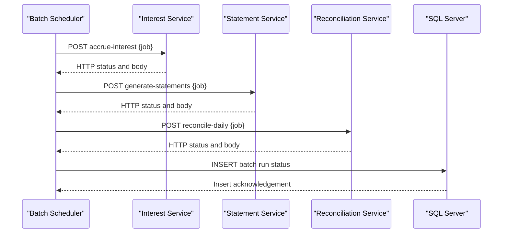

# API & Service Communication Contracts

The application exposes no inbound API endpoints and instead performs scheduled outbound HTTP calls to downstream services.

## Service Catalog

| Service | Port | Category | Purpose |
|---|---|---|---|
| zava-batch-scheduler | N/A (client process) | Business | Coordinates nightly batch execution |
| zavainterestcalculator | 8080 | Business | Handles interest accrual batch requests |
| zavastatementservice | 8080 | Business | Generates account statements |
| zavaledger | 8080 | Business | Runs daily reconciliation |

## API Endpoints Inventory

| Service | Method | Path | Request Type | Response Type |
|---|---|---|---|---|
| zava-batch-scheduler (outbound) | POST | /api/batch/accrue-interest | JSON job payload | HTTP status + body |
| zava-batch-scheduler (outbound) | POST | /api/batch/generate-statements | JSON job payload | HTTP status + body |
| zava-batch-scheduler (outbound) | POST | /api/batch/reconcile-daily | JSON job payload | HTTP status + body |

## Management & Observability Endpoints

| Service | Endpoint | Custom Metrics (if any) |
|---|---|---|
| zava-batch-scheduler | None detected | None detected |

## DTOs & Contracts

The scheduler sends simple JSON command payloads for each job type (`interest_accrual`, `statement_generation`, `daily_reconciliation`) and treats downstream responses as opaque text body plus HTTP status. No OpenAPI, protobuf, or GraphQL contracts are defined in this repository.

## Communication Patterns

Communication is synchronous REST over HTTP using `HttpURLConnection` with configurable connect/read timeout (`http.timeout.ms`, default 15000 ms). No retry, circuit-breaker, service discovery, or API gateway is implemented; endpoint base URLs are configured directly via properties/environment variables. No authentication, authorization, or TLS configuration is present in this codebase-level contract.

## Service Technology Matrix

| Service | Web | Data Access | Discovery | Gateway | Actuator | Cache | Metrics |
|---|---|---|---|---|---|---|---|
| zava-batch-scheduler | None | JDBC (write-only run logs) | None | None | None | None | None |

## Service Communication Sequence

