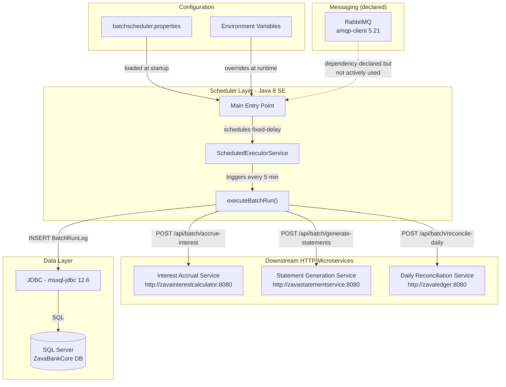
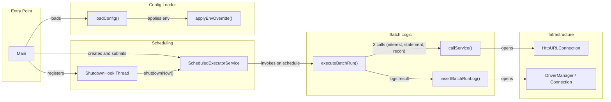

# Architecture Diagram

ZavaBatchScheduler is a Java 8 standalone batch scheduler that periodically invokes three downstream banking microservices and persists execution results to a SQL Server database.

## Application Architecture

### Technology Stack Summary

| Layer | Technology | Version | Purpose |
|-------|-----------|---------|---------|
| Scheduler | Java SE | 8 (source/target 1.8) | Application runtime and scheduling |
| Build | Gradle + Shadow Plugin | 7.6 / 7.1.2 | Build toolchain and fat-jar packaging |
| HTTP Client | java.net.HttpURLConnection | Java SE built-in | Calling downstream banking microservices |
| Data Access | JDBC (mssql-jdbc) | 12.6.1.jre8 | SQL Server batch run log persistence |
| Messaging | amqp-client (RabbitMQ) | 5.21.0 | Declared dependency; not used in current code |
| Container | Docker (Gradle 7.6/JDK 8 build, Temurin 8 JRE runtime) | — | Multi-stage container image |
| Configuration | Properties file + env vars | — | Runtime configuration with environment override |

### Data Storage & External Services

The application stores nightly batch execution audit records in a **SQL Server** database (`ZavaBankCore`) via plain JDBC, inserting rows into a `BatchRunLog` table that captures run type, start/end timestamps, status, and per-job details. Three downstream HTTP microservices (`zavainterestcalculator`, `zavastatementservice`, `zavaledger`) are called sequentially over HTTP/POST on each scheduled cycle. A **RabbitMQ** dependency (`amqp-client 5.21.0`) is declared in the build but is not actively exercised in the current source code.

### Key Architectural Decisions

- **Fixed-delay scheduling**: Uses `ScheduledExecutorService.scheduleWithFixedDelay` with a configurable interval (default 5 minutes) to serialize batch runs, preventing overlapping executions.
- **Configuration via properties + env-var override**: A classpath properties file provides defaults; all settings can be overridden by environment variables, enabling containerized deployment without image rebuilds.
- **Fat-jar packaging via Shadow plugin**: The application is packaged as a self-contained uber-jar (`*-all.jar`) using the Gradle Shadow plugin, simplifying Docker deployment.

## Component Relationships

### Component Inventory

| Component | Layer | Type | Responsibility |
|-----------|-------|------|---------------|
| `Main` | Entry Point | Java main class | Application bootstrap: loads config, creates scheduler, registers shutdown hook |
| `ScheduledExecutorService` | Scheduling | JDK concurrency | Fixed-delay execution of batch jobs every N milliseconds |
| `ShutdownHook Thread` | Scheduling | JVM shutdown hook | Gracefully stops the scheduler on SIGTERM/SIGINT |
| `executeBatchRun()` | Batch Logic | Private method | Orchestrates the three service calls and records outcome |
| `callService()` | Batch Logic | Private method | Performs a single HTTP POST to a downstream microservice |
| `insertBatchRunLog()` | Batch Logic | Private method | Writes a `BatchRunLog` row to SQL Server via JDBC |
| `loadConfig()` | Config Loader | Private method | Reads `batchscheduler.properties` from classpath |
| `applyEnvOverride()` | Config Loader | Private method | Overrides property values from environment variables |
| `HttpURLConnection` | Infrastructure | JDK HTTP client | Low-level HTTP transport for service calls |
| `DriverManager / Connection` | Infrastructure | JDBC | SQL Server connection management and statement execution |
