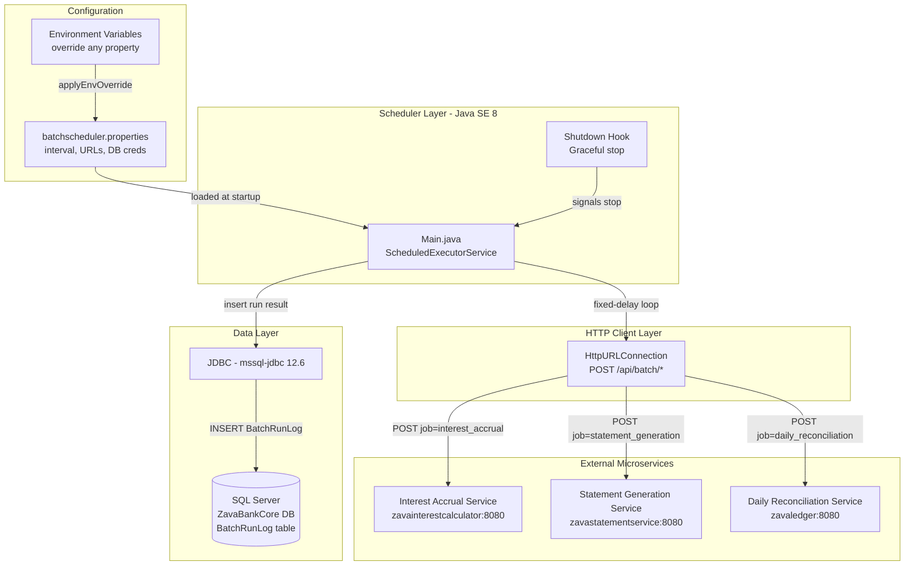
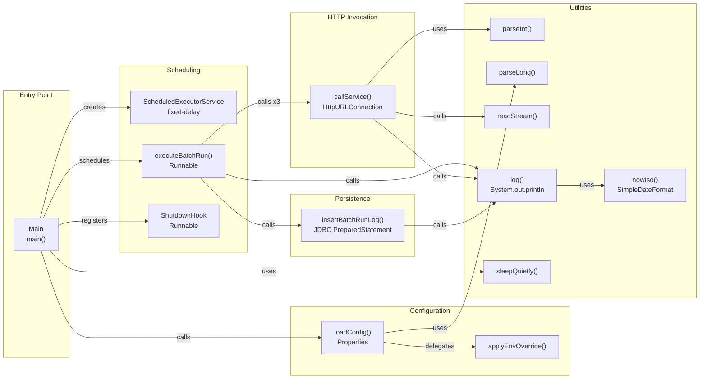

# Architecture Diagram

ZavaBatchScheduler is a single-class Java 8 background service that periodically invokes three financial microservices over HTTP and persists run outcomes to a SQL Server database.

## Application Architecture

### Technology Stack Summary

| Layer | Technology | Version | Purpose |
|-------|-----------|---------|---------|
| Runtime | Java SE (OpenJDK) | 8 (1.8) | Application JVM runtime |
| Build | Gradle | 7.6 (via Docker) | Dependency management and fat-JAR assembly |
| Fat JAR packaging | Shadow plugin | 7.1.2 | Produces self-contained `*-all.jar` |
| HTTP client | `java.net.HttpURLConnection` | JDK built-in | POST requests to downstream services |
| Scheduling | `java.util.concurrent.ScheduledExecutorService` | JDK built-in | Fixed-delay batch interval |
| Database driver | Microsoft JDBC Driver for SQL Server | 12.6.1.jre8 | SQL Server connectivity |
| Messaging library | RabbitMQ amqp-client | 5.21.0 | Declared but unused in current code |
| Container base | eclipse-temurin | 8-jre | Production JRE image |

### Data Storage & External Services

The application uses a single SQL Server database (`ZavaBankCore`) to record batch run outcomes in the `BatchRunLog` table. Connection parameters (host, port, database name, credentials) are read from `batchscheduler.properties` and can be overridden at runtime via environment variables (`SQLSERVER_URL`, `SQLSERVER_USERNAME`, `SQLSERVER_PASSWORD`). Three external HTTP microservices are called synchronously: the Interest Accrual Service, Statement Generation Service, and Daily Reconciliation Service. Their base URLs and endpoint paths are similarly configurable via environment variables, defaulting to Docker Compose internal hostnames.

### Key Architectural Decisions

- **Single-class monolith**: All scheduling, HTTP invocation, database logging, and configuration loading are implemented in one `Main.java` file, making the application simple but hard to extend or test in isolation.
- **Environment-variable override pattern**: Every property in `batchscheduler.properties` has a corresponding environment-variable override applied at startup, providing basic twelve-factor app compatibility.
- **Synchronous, sequential service calls**: The three downstream service calls are executed sequentially in a single thread. A failure or timeout in one call delays subsequent calls but does not prevent the batch run from completing.

## Component Relationships

### Component Inventory

| Component | Layer | Type | Responsibility |
|-----------|-------|------|---------------|
| `Main.main()` | Entry Point | Static entry point | Loads config, creates scheduler, registers shutdown hook, runs main loop |
| `ScheduledExecutorService` | Scheduling | JDK component | Fires `executeBatchRun` at configurable fixed-delay intervals |
| `executeBatchRun()` | Scheduling | Private method | Orchestrates three service calls and logs outcome to database |
| `ShutdownHook` (anonymous Runnable) | Scheduling | JVM hook | Sets `running=false` and shuts down scheduler on SIGTERM |
| `callService()` | HTTP Invocation | Private method | Opens `HttpURLConnection`, POSTs JSON payload, reads response, returns success/failure |
| `insertBatchRunLog()` | Persistence | Private method | Opens JDBC connection, inserts run start/end time, status, and details into `BatchRunLog` |
| `loadConfig()` | Configuration | Private method | Loads `batchscheduler.properties` from classpath, then applies environment-variable overrides |
| `applyEnvOverride()` | Configuration | Private method | Checks each named environment variable and overwrites the corresponding property key if set |
| `log()` | Utilities | Private method | Writes timestamped lines to standard output |
| `nowIso()` | Utilities | Private method | Formats current time as ISO 8601 string for log output |
| `readStream()` | Utilities | Private method | Reads HTTP response body from InputStream to String |
| `parseInt()` / `parseLong()` | Utilities | Private method | Safe numeric parsing with fallback default value |
| `sleepQuietly()` | Utilities | Private method | Sleeps the main thread in the keep-alive loop, handling interrupt |
