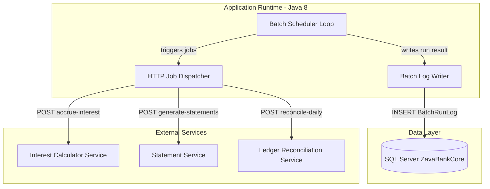
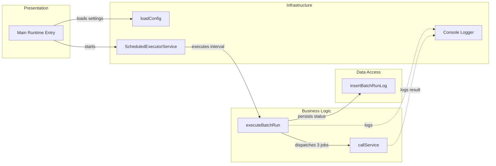

# Architecture Diagram

This document summarizes the scheduler application structure and its runtime component relationships.

## Application Architecture

### Technology Stack Summary

| Layer | Technology | Version | Purpose |
|---|---|---|---|
| Runtime | Java SE | 8 | Executes scheduled batch orchestration |
| Build | Gradle | 7.x plugin set | Builds and packages application |
| Data Access | JDBC + SQL Server driver | mssql-jdbc 12.6.1.jre8 | Persists batch execution logs |
| Integration | HTTP via HttpURLConnection | JDK built-in | Invokes downstream batch APIs |

### Data Storage & External Services

The scheduler stores batch run status in a SQL Server database table (`BatchRunLog`) and calls three external HTTP services for interest accrual, statement generation, and daily reconciliation.

### Key Architectural Decisions

- Uses a single-process scheduler (`ScheduledExecutorService`) for fixed-delay batch execution.
- Uses direct HTTP calls to downstream services with timeout configuration from properties.
- Uses direct JDBC writes for operational run logging.

## Component Relationships

### Component Inventory

| Component | Layer | Type | Responsibility |
|---|---|---|---|
| Main runtime entry | Presentation | Bootstrap | Initializes config, scheduler, and shutdown hook |
| ScheduledExecutorService | Infrastructure | Scheduler | Executes periodic batch runs |
| executeBatchRun | Business Logic | Orchestrator | Runs three downstream jobs and aggregates status |
| callService | Business Logic | HTTP client helper | Calls external services and evaluates success/failure |
| insertBatchRunLog | Data Access | JDBC persistence | Inserts execution status into BatchRunLog table |
| loadConfig | Infrastructure | Configuration loader | Reads properties and environment overrides |
| Console logger | Infrastructure | Logging utility | Emits operational events with timestamps |
