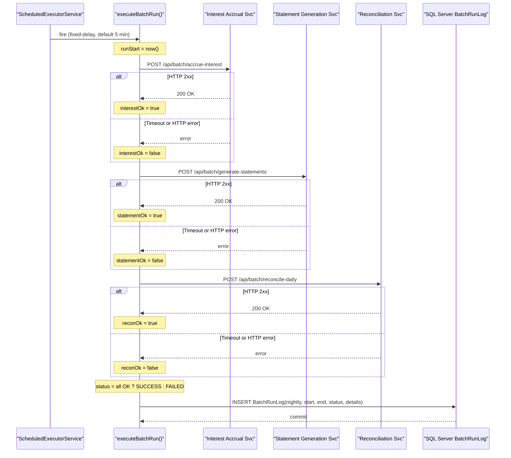

# Core Business Workflows

ZavaBatchScheduler automates nightly financial batch processing for ZavaBank by orchestrating three sequential service calls — interest accrual, statement generation, and daily reconciliation — and recording each run's outcome to a SQL Server audit table.

## Domain Entities

| Entity | Service / Bounded Context | Description | Key Relationships |
|--------|--------------------------|-------------|-------------------|
| BatchRunLog | ZavaBatchScheduler | Audit record for each scheduled batch execution — captures timing, per-job success/failure, and overall status | Self-contained; no FK references to other tables |
| Account (external) | Interest Accrual Service | Accounts receiving interest accrual (owned by upstream service) | Referenced indirectly by the interest accrual job |
| Statement (external) | Statement Generation Service | Account statements generated per cycle (owned by upstream service) | Referenced indirectly by the statement job |
| LedgerEntry (external) | Daily Reconciliation Service | Ledger entries reconciled each night (owned by upstream service) | Referenced indirectly by the reconciliation job |

## Service-to-Domain Mapping

| Service | Domain Context | Owned Entities | External Dependencies |
|---------|---------------|----------------|----------------------|
| ZavaBatchScheduler | Batch Orchestration | `BatchRunLog` | Interest Accrual Service (HTTP), Statement Generation Service (HTTP), Daily Reconciliation Service (HTTP), SQL Server `ZavaBankCore` |
| Interest Accrual Service | Interest Management | Account interest data (external) | Consumed via POST `/api/batch/accrue-interest` |
| Statement Generation Service | Statement Management | Account statements (external) | Consumed via POST `/api/batch/generate-statements` |
| Daily Reconciliation Service | Ledger Reconciliation | Ledger entries (external) | Consumed via POST `/api/batch/reconcile-daily` |

## Primary Workflows

### Workflow 1: Scheduled Batch Run

The core workflow fires automatically at a configurable interval (default every 5 minutes, controlled by `scheduler.interval.ms`). On each invocation, the scheduler calls three downstream financial services sequentially and logs the aggregate result.

**Steps:**
1. `ScheduledExecutorService` fires `executeBatchRun()` after the configured fixed delay.
2. Record `runStart = new Date()`.
3. Call Interest Accrual Service — POST `{"job":"interest_accrual"}` to `interest.service.url + interest.service.endpoint`. Capture HTTP response: 2xx = `interestOk=true`, otherwise `interestOk=false`.
4. Call Statement Generation Service — POST `{"job":"statement_generation"}` to `statement.service.url + statement.service.endpoint`. Capture HTTP response: 2xx = `statementOk=true`, otherwise `statementOk=false`.
5. Call Daily Reconciliation Service — POST `{"job":"daily_reconciliation"}` to `reconciliation.service.url + reconciliation.service.endpoint`. Capture HTTP response: 2xx = `reconOk=true`, otherwise `reconOk=false`.
6. Determine overall status: `SUCCESS` if all three booleans are `true`; `FAILED` otherwise.
7. Build details string: `"interest=true/false, statements=true/false, reconciliation=true/false"`.
8. Log status line to stdout.
9. `insertBatchRunLog()`: open JDBC connection to SQL Server, INSERT into `BatchRunLog` with `RunType="nightly"`, `StartedAt`, `EndedAt`, `Status`, `Details`.

**Business rules involved:**
- All three jobs must succeed for the run to be marked `SUCCESS`.
- Individual job failures do not stop subsequent jobs within the same run.
- Failed runs are recorded in the audit table but trigger no alert, retry, or escalation.

### Workflow 2: Application Startup and Configuration

Before the scheduler fires, the application loads and validates its configuration.

**Steps:**
1. JVM starts and calls `Main.main()`.
2. `loadConfig("batchscheduler.properties")` — reads properties from classpath.
3. `applyEnvOverride()` — for each of 10 known environment variables, overwrite the corresponding property if the variable is non-empty.
4. Parse `scheduler.interval.ms` from config (default 300 000 ms).
5. Register JVM shutdown hook: sets `running=false` and calls `scheduler.shutdownNow()`.
6. Create `ScheduledExecutorService` with a single thread.
7. Schedule `executeBatchRun` with initial delay 0 and fixed delay of `intervalMs` milliseconds.
8. Enter keep-alive loop (`while (running) sleepQuietly(1000)`).

### Workflow 3: Graceful Shutdown

Triggered by SIGTERM (e.g., Docker stop, Kubernetes pod termination).

**Steps:**
1. JVM receives shutdown signal.
2. Registered `ShutdownHook` thread executes: sets `volatile boolean running = false`.
3. `scheduler.shutdownNow()` interrupts the scheduled executor.
4. Main thread exits the `while (running)` keep-alive loop.
5. Application logs `"ZavaBatchScheduler stopped."` and exits.

**Note:** If a batch run is in progress when shutdown is requested, `shutdownNow()` will attempt to interrupt it. The in-flight HTTP call may or may not complete depending on whether the interrupt is handled before the connection timeout.

## Cross-Service Data Flows

ZavaBatchScheduler acts as a pure orchestrator. It does not aggregate or merge data from downstream services — it only records whether each HTTP call succeeded. The data flow is strictly:

```
Scheduler → POST (fire-and-forget semantics) → Downstream Service (processes request autonomously)
                                                            ↓
                                               HTTP 2xx / non-2xx response
                                                            ↓
Scheduler ← boolean result ← callService() wrapper
                 ↓
    SQL Server BatchRunLog INSERT (audit only)
```

There is no gateway aggregation, no response body processing (beyond logging the raw string), and no circuit breaker fallback that would return partial data to any consumer.

## Business Workflow Sequence



## Business Rules & Decision Logic

### Business Rules

**Success determination:**
- A batch run is `SUCCESS` only when all three downstream calls return HTTP 2xx.
- Partial success (e.g., two of three jobs succeed) is still recorded as `FAILED`.
- There is no concept of a "partial success" or "warning" status.

**Job independence:**
- Each of the three jobs is attempted regardless of the outcome of the preceding jobs. A failed interest accrual call does not skip statement generation.

**No retry logic:**
- Failed HTTP calls are not retried within the same batch run.
- The next opportunity is the following scheduled run (default 5 minutes later).

**Audit trail:**
- Every completed batch run (whether SUCCESS or FAILED) is unconditionally inserted into `BatchRunLog`.
- The `details` field carries per-job boolean results for post-hoc diagnosis.

### Validation Rules

- Service URL and endpoint must be non-null before a call is attempted; if either is missing, the call is skipped and logged as failed (`log("Skipping " + jobName + " due to missing URL/endpoint.")`).
- `scheduler.interval.ms` is parsed with a fallback to 300 000 ms if the value is missing or non-numeric.
- `http.timeout.ms` is parsed with a fallback to 15 000 ms.

### State Transitions

The application itself has minimal state:

| State | Condition |
|-------|-----------|
| `running = true` | Immediately after `main()` starts |
| `running = false` | JVM shutdown hook fires (SIGTERM / SIGINT) |

Batch run state transitions are implicit — each invocation of `executeBatchRun()` is stateless relative to previous runs.

### Cross-Cutting Concerns

**Logging:** All significant events are written to stdout with an ISO 8601 timestamp prefix. There is no log level filtering, log rotation, or external log shipper.

**Error handling:** All HTTP and JDBC exceptions are caught, logged to stdout, and translated to a boolean result (`false` / failure). No exceptions propagate to the scheduler thread level, preventing the scheduler from terminating due to a single run's failure.

**Transactions:** The JDBC INSERT uses auto-commit (no explicit transaction boundary). If the INSERT fails, the run outcome is lost silently (exception is caught and logged but not re-thrown).

**No authorization:** There is no role-based or attribute-based access control. The application makes all calls unconditionally as long as it is running.
