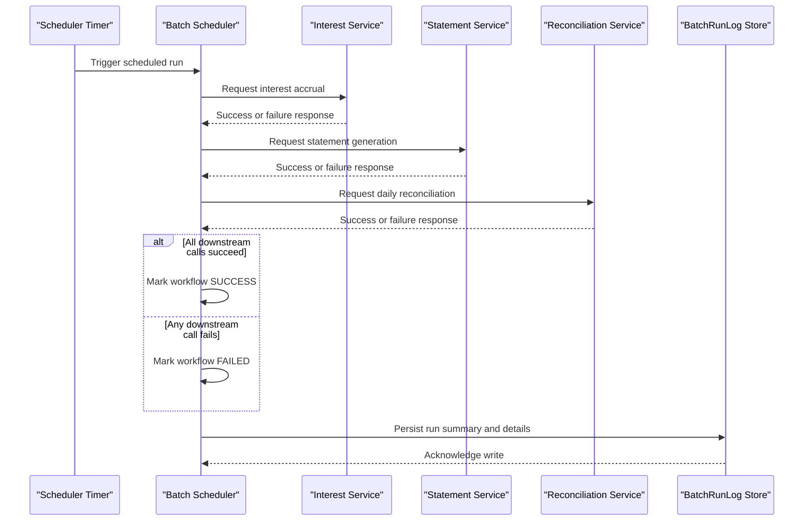

# Core Business Workflows

The application coordinates recurring banking batch operations and records run outcomes for operational visibility.

## Domain Entities

| Entity | Service / Bounded Context | Description | Key Relationships |
|---|---|---|---|
| BatchRunLog | Batch Scheduling | Audit record of each scheduler cycle outcome | Captures aggregated result of three downstream jobs |
| Interest Accrual Job | Interest Processing | Downstream command to accrue interest | Triggered by scheduler each cycle |
| Statement Generation Job | Statement Processing | Downstream command to produce statements | Triggered by scheduler each cycle |
| Daily Reconciliation Job | Ledger Processing | Downstream command to reconcile ledger | Triggered by scheduler each cycle |

## Service-to-Domain Mapping

| Service | Domain Context | Owned Entities | External Dependencies |
|---|---|---|---|
| zava-batch-scheduler | Batch Orchestration | BatchRunLog and job orchestration state | Interest service, Statement service, Reconciliation service, SQL Server |

## Primary Workflows

### Workflow 1: Scheduled Nightly Batch Orchestration

1. Scheduler interval triggers a batch cycle.
2. Scheduler submits interest accrual job request.
3. Scheduler submits statement generation job request.
4. Scheduler submits reconciliation job request.
5. Scheduler combines three outcomes into SUCCESS/FAILED summary.
6. Scheduler writes one BatchRunLog record with details.

## Cross-Service Data Flows

The scheduler sends independent command requests to three downstream services and aggregates only response status/body text locally. No cross-service data composition is performed across downstream payloads. If one service fails, the overall cycle is marked FAILED while still recording outcomes for all three calls.

## Business Workflow Sequence

## Business Rules & Decision Logic

- A run is marked `SUCCESS` only when all three downstream operations return 2xx status.
- Any failed downstream call changes final run status to `FAILED`.
- Scheduler continues execution even when individual downstream calls fail, ensuring run logging still occurs.
- Shutdown hook flips runtime flag and stops scheduler gracefully.
