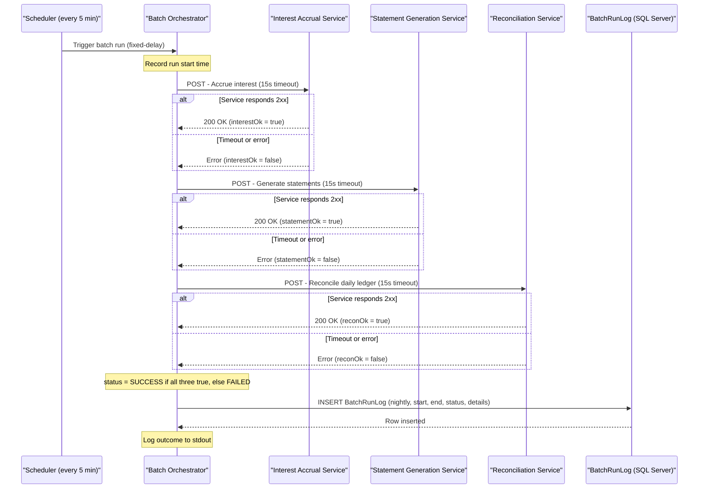

# Core Business Workflows

ZavaBatchScheduler automates the end-of-day banking operations for Zava Bank by orchestrating interest accrual, statement generation, and daily ledger reconciliation across three downstream services on a recurring schedule.

## Domain Entities

| Entity | Service / Bounded Context | Description | Key Relationships |
|--------|--------------------------|-------------|------------------|
| Batch Run | Batch Orchestration | A single scheduled execution cycle that triggers all three banking jobs and records the aggregate outcome | Composed of three Job Results (interest, statements, reconciliation) |
| Job Result | Batch Orchestration | The success/failure outcome of a single downstream service call within a batch run | Belongs to one Batch Run |
| Batch Run Log | Audit / Observability | Persistent audit record of a completed batch run stored in SQL Server (`BatchRunLog` table) | Captures one Batch Run per row |
| Interest Accrual Job | Interest Domain (zavainterestcalculator) | Applies overnight interest calculations to customer accounts | Triggered by Batch Run |
| Statement Generation Job | Statement Domain (zavastatementservice) | Produces periodic account statements for customers | Triggered by Batch Run |
| Daily Reconciliation Job | Ledger Domain (zavaledger) | Reconciles daily transactions and balances in the bank's general ledger | Triggered by Batch Run |

## Service-to-Domain Mapping

| Service | Domain Context | Owned Entities | External Dependencies |
|---------|---------------|---------------|----------------------|
| ZavaBatchScheduler | Batch Orchestration / Audit | Batch Run, Job Result, Batch Run Log | zavainterestcalculator, zavastatementservice, zavaledger, SQL Server (ZavaBankCore) |
| zavainterestcalculator | Interest Accrual | Interest Accrual Job outcome (source not in this repo) | Unknown |
| zavastatementservice | Statement Generation | Statement Generation Job outcome (source not in this repo) | Unknown |
| zavaledger | Ledger Reconciliation | Daily Reconciliation Job outcome (source not in this repo) | Unknown |

ZavaBatchScheduler is the **single source of truth** for batch run history. It has no knowledge of the internal domain models of the downstream services — it interacts with them exclusively via fire-and-forget HTTP POST calls and interprets success by HTTP status code alone.

## Primary Workflows

### Workflow 1: Scheduled Nightly Batch Run

**Trigger:** `ScheduledExecutorService` fires every 5 minutes (configurable via `scheduler.interval.ms`). The first execution runs immediately at application startup (delay = 0).

**Steps:**

1. **Check running flag** — if the application is in shutdown state, the cycle is skipped immediately.
2. **Call Interest Accrual** — POST `{"job":"interest_accrual"}` to `interest.service.url` + `interest.service.endpoint`. Awaits HTTP response with a 15-second timeout. Records `interestOk = true` if response status is 2xx.
3. **Call Statement Generation** — POST `{"job":"statement_generation"}` to `statement.service.url` + `statement.service.endpoint`. Same timeout and success criterion.
4. **Call Daily Reconciliation** — POST `{"job":"daily_reconciliation"}` to `reconciliation.service.url` + `reconciliation.service.endpoint`. Same timeout and success criterion.
5. **Determine aggregate status** — if all three calls returned `true`, status = `SUCCESS`; otherwise status = `FAILED`.
6. **Persist audit record** — INSERT one row into `BatchRunLog` with run type `nightly`, start/end timestamps, aggregate status, and per-job boolean details.
7. **Log outcome** — write outcome to stdout.

**Business rules involved:** All three jobs are mandatory for a successful batch run. There is no partial-success state — a single failing job marks the entire run as `FAILED`. Jobs execute **sequentially** in a fixed order: interest → statements → reconciliation.

### Workflow 2: Graceful Shutdown

**Trigger:** JVM shutdown signal (SIGTERM, SIGINT, or `Runtime.halt()`).

**Steps:**

1. **ShutdownHook activates** — sets the `running` flag to `false`.
2. **Scheduler stopped** — `ScheduledExecutorService.shutdownNow()` is called, cancelling any pending scheduled tasks.
3. **In-flight run may complete or be interrupted** — if a batch run is in progress when shutdown is requested, it may be interrupted mid-flight (no transaction or compensation mechanism exists).
4. **Application exits** — the main thread exits the wait loop and logs the stop message.

## Cross-Service Data Flows

ZavaBatchScheduler drives a **fire-and-forget orchestration** pattern: it calls each downstream service in turn, passing a minimal JSON payload, and treats any HTTP 2xx response as a successful trigger. No data from downstream services is stored, forwarded, or aggregated — each service operates independently on its own data.

**Fallback behavior:** There is no circuit breaker, retry, or fallback. If a downstream service returns an error or times out:
- The job result is recorded as `false` in the `details` field of `BatchRunLog`.
- The scheduler continues to the next job without waiting or retrying.
- The overall batch run is recorded as `FAILED`.
- On the next scheduled cycle (5 minutes later), all three jobs are attempted again from scratch regardless of which failed previously.

This means a persistent outage of a single service will cause every subsequent batch run to be recorded as `FAILED` with no alerting or automatic remediation.

## Business Workflow Sequence

## Business Rules & Decision Logic

### Batch Execution Rules

- **All-or-nothing success criterion:** A batch run is `SUCCESS` only if all three downstream jobs return HTTP 2xx. Any single failure marks the entire run as `FAILED`. There is no concept of a partially successful run.
- **Fixed sequential execution order:** Interest accrual always runs first, then statement generation, then reconciliation. This order is hardcoded and not configurable; if the order matters for business correctness (e.g., reconciliation depends on interest being applied first), this is an implicit dependency.
- **No skip-on-failure:** Even if interest accrual fails, statement generation and reconciliation are still attempted on the same cycle.
- **Configurable interval, not a specific time:** The scheduler uses a fixed delay (default 5 minutes) rather than a cron expression. This means the batch does not run at a guaranteed wall-clock time (e.g., midnight), but rather at intervals relative to application startup.
- **Immediate first run:** The first batch cycle fires at application startup with zero delay. If downstream services or the database are not yet ready, the first run will fail.

### Audit Rules

- **Every cycle produces a log entry:** A `BatchRunLog` row is always inserted, regardless of outcome. The `Details` field captures the per-job boolean results (e.g., `interest=true, statements=false, reconciliation=true`).
- **No duplicate prevention:** There is no idempotency key or deduplication check. If the application is restarted rapidly, multiple batch runs may execute close together.

### Error Handling

- **HTTP errors / timeouts:** Caught silently as `Exception` in `callService()`; the method returns `false` and logs the failure to stdout. No retry is attempted.
- **Database failures:** A failed `BatchRunLog` insert is caught silently; the error is logged to stdout but the scheduler continues running normally.
- **Shutdown race condition:** If a shutdown signal arrives during an active batch run, the run may be left partially executed with no compensating transaction or rollback.

### Cross-Cutting Concerns

- **Transaction management:** No transaction boundaries are defined. Each downstream HTTP call and each database INSERT is an independent, non-atomic operation.
- **Audit trail:** The `BatchRunLog` table serves as the primary audit trail, recording every execution with timestamp, status, and job-level details.
- **Authorization:** No authentication or authorization is applied to any outbound calls. All downstream services are assumed to be accessible without credentials.
- **Observability:** Logging is limited to `System.out.println` statements. There are no structured logs, metrics, or distributed tracing instrumentation.
