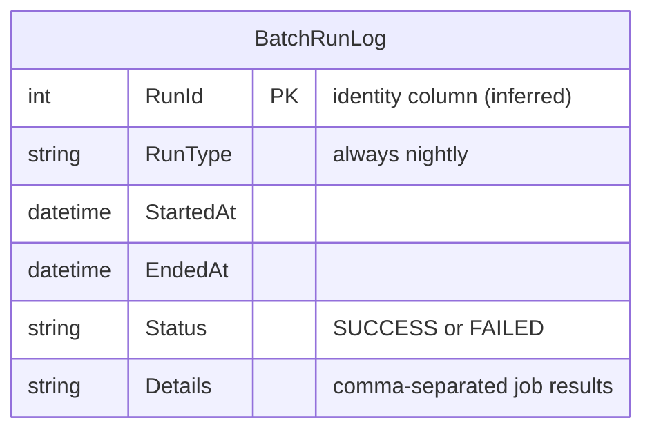

# Data Architecture & Persistence Layer

ZavaBatchScheduler uses a single SQL Server database accessed via direct JDBC (no ORM). There is one application-managed table (`BatchRunLog`) that records the outcome of each scheduled batch run.

## Database Configuration

| Service/Module | DB Type | Profile | Driver | Connection | Migration Tool |
|---------------|---------|---------|--------|------------|---------------|
| ZavaBatchScheduler | SQL Server | default (all environments) | mssql-jdbc 12.6.1.jre8 | `jdbc:sqlserver://sqlserver:1433;databaseName=ZavaBankCore;encrypt=false;trustServerCertificate=true` | None — no schema migration tool configured |

> For full configuration property keys and values see `configuration-inventory.md`.

Schema management is entirely manual. No Flyway, Liquibase, or DDL auto-generation is configured. The `BatchRunLog` table must be created out-of-band before the application starts. The `encrypt=false;trustServerCertificate=true` JDBC flags disable TLS encryption and certificate validation on the database connection.

## Data Ownership per Service

| Service | Tables Owned | ORM Framework | Caching | Notes |
|---------|-------------|---------------|---------|-------|
| ZavaBatchScheduler | `BatchRunLog` | None (plain JDBC) | None | Single-column `RunType` always set to `"nightly"`; no read queries — write-only access pattern |

## Entity Model

> Note: There are no JPA/Hibernate entities or annotated model classes in the source tree. The `BatchRunLog` table structure is inferred from the JDBC `PreparedStatement` insert in `insertBatchRunLog()`.

## Key Repository Methods

There are no repository interfaces. Database access is performed via inline JDBC in `Main.insertBatchRunLog()`.

| Service | Method | SQL / Operation | Purpose |
|---------|--------|-----------------|---------|
| ZavaBatchScheduler | `insertBatchRunLog(config, startedAt, endedAt, status, details)` | `INSERT INTO BatchRunLog (RunType, StartedAt, EndedAt, Status, Details) VALUES (?, ?, ?, ?, ?)` | Persists the outcome of each batch run with timing and per-job status |

No read queries are issued by the application; `BatchRunLog` is append-only from the scheduler's perspective.

## Caching Strategy

No caching layer is implemented or configured. The application performs no reads from the database and caches no data in memory beyond the loaded `Properties` object at startup.

## Data Ownership Boundaries

ZavaBatchScheduler is the sole owner of the `BatchRunLog` table within the `ZavaBankCore` SQL Server database. The database is shared with other Zava Bank services (the same SQL Server instance hosts the core banking schema), but the batch scheduler only reads/writes its own table.

The application does not query any data owned by downstream services (interest accrual, statement generation, reconciliation). It retrieves results only via the HTTP response status code of each POST call. Cross-service data access is strictly HTTP-based; there is no direct database-to-database access.

### Data Classification & Sensitivity

| Entity | Sensitive Fields | Classification | Controls in Place |
|--------|-----------------|----------------|-------------------|
| `BatchRunLog` | None (operational metadata only) | Internal | No encryption-at-rest or masking required for run log data |

The `BatchRunLog` table stores only operational metadata (run timestamps, status, job boolean results). No PII, PHI, or PCI data is written to the database by this service.

However, the JDBC connection string in `batchscheduler.properties` includes a plain-text password (`db.****** committed to the repository. The connection also disables TLS (`encrypt=false`), meaning database credentials and any data in transit are exposed to network sniffing. These are configuration-level security issues rather than data-model issues; see `configuration-inventory.md` for details.
