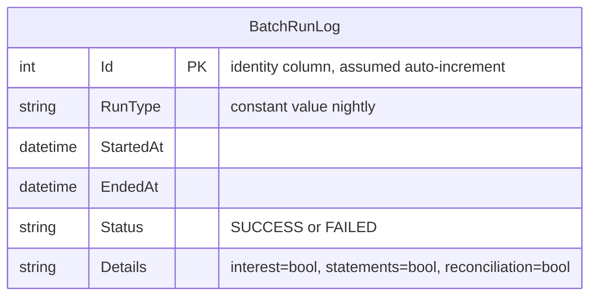

# Data Architecture & Persistence Layer

ZavaBatchScheduler uses a single SQL Server database (`ZavaBankCore`) accessed exclusively via plain JDBC — there is no ORM framework — with one table (`BatchRunLog`) used purely for batch execution audit records.

## Database Configuration

| Service/Module | DB Type | Profile | Driver | Connection | Migration Tool |
|---------------|---------|---------|--------|-----------|---------------|
| ZavaBatchScheduler | SQL Server | All (single profile) | mssql-jdbc 12.6.1.jre8 | `jdbc:sqlserver://sqlserver:1433;databaseName=ZavaBankCore;encrypt=false;trustServerCertificate=true` | None — schema is assumed to pre-exist; no Flyway/Liquibase or DDL auto-generation |

> See `configuration-inventory.md` for the full property key inventory. Notably, `encrypt=false` and `trustServerCertificate=true` disable TLS and certificate validation, which is incompatible with Azure SQL Database requirements.

## Data Ownership per Service

| Service | Tables Owned | ORM Framework | Caching | Notes |
|---------|-------------|--------------|---------|-------|
| ZavaBatchScheduler | `BatchRunLog` | None (plain JDBC via `DriverManager`) | None | Append-only audit log; connection opened and closed per batch run — no connection pooling configured |

## Entity Model

> **Note:** The `BatchRunLog` schema is inferred from the `INSERT` statement in `insertBatchRunLog()`. No DDL script, migration file, or ORM entity class exists in the repository — the table is expected to be pre-created externally.

## Key Repository Methods

| Service | Repository | Notable Methods | Purpose |
|---------|-----------|----------------|---------|
| ZavaBatchScheduler | `insertBatchRunLog()` (ad-hoc JDBC) | `INSERT INTO BatchRunLog (RunType, StartedAt, EndedAt, Status, Details) VALUES (?, ?, ?, ?, ?)` | Appends one row per batch run cycle recording job outcome |

No repository interfaces, Spring Data repositories, MyBatis mappers, or query methods are defined. All data access is performed inline within `Main.java` using `DriverManager.getConnection()` and `PreparedStatement`.

## Caching Strategy

No caching layer is implemented. There are no Spring Cache annotations, Redis client, EhCache, Caffeine, or any in-memory cache configuration. Each batch run opens a fresh JDBC connection directly via `DriverManager` without a connection pool (no HikariCP or DBCP), which means a new TCP connection to SQL Server is established on every scheduled cycle.

## Data Ownership Boundaries

ZavaBatchScheduler owns only the `BatchRunLog` table. The three downstream microservices (`zavainterestcalculator`, `zavastatementservice`, `zavaledger`) own their own data stores (source not in this repository); ZavaBatchScheduler does not query or share data with them beyond the HTTP trigger calls — there is no cross-service database access.

The data model is entirely isolated to the audit/observability concern. The absence of a connection pool means the database connection lifecycle is not shared or reused across batch run cycles.

### Data Classification & Sensitivity

| Entity | Sensitive Fields | Classification | Controls in Place |
|--------|-----------------|---------------|-------------------|
| `BatchRunLog` | None — contains only operational metadata (run type, timestamps, status strings) | None (operational/audit data only) | N/A |
| Connection credentials (`db.username`, `db.password`) | `db.password` = `YourStrong!Passw0rd` stored in plaintext | Confidential — credential | **No controls**: hardcoded in `batchscheduler.properties`, transmitted in plain text (no TLS on JDBC connection), no secrets manager or vault integration |

No PII, PHI, or PCI data is stored by ZavaBatchScheduler directly. However, the hardcoded SQL Server password in `batchscheduler.properties` represents a significant credential exposure risk that must be remediated (e.g., via Azure Key Vault secrets injection) before cloud migration.
