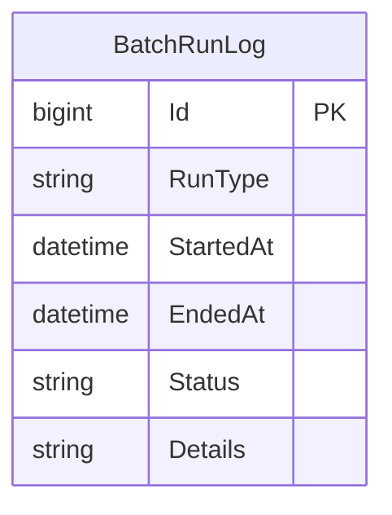

# Data Architecture & Persistence Layer

The data layer is lightweight, centered on SQL Server persistence for batch-run audit data via direct JDBC calls.

## Database Configuration

| Service/Module | DB Type | Profile | Driver | Connection | Migration Tool |
|---|---|---|---|---|---|
| batchscheduler | SQL Server | default | com.microsoft.sqlserver:mssql-jdbc:12.6.1.jre8 | JDBC URL from `db.url` / `SQLSERVER_URL` | None detected |

## Data Ownership per Service

| Service | Tables Owned | ORM Framework | Caching | Notes |
|---|---|---|---|---|
| zava-batch-scheduler | BatchRunLog | Plain JDBC (no ORM) | None | Writes one record per scheduler execution |

## Entity Model

## Key Repository Methods

| Service | Repository | Notable Methods | Purpose |
|---|---|---|---|
| zava-batch-scheduler | Main.insertBatchRunLog | `insertBatchRunLog(Properties, Date, Date, String, String)` | Inserts runtime result into BatchRunLog |

## Caching Strategy

No caching layer or cache annotations are present. All persistence writes are immediate JDBC operations.

## Data Ownership Boundaries

A single scheduler service writes operational status to one SQL Server table. Cross-service data access to external systems is performed through HTTP APIs, not shared database reads.

### Data Classification & Sensitivity

| Entity | Sensitive Fields | Classification (PII/PHI/PCI/None) | Controls in Place |
|---|---|---|---|
| BatchRunLog | Execution details may include service responses | Internal | No explicit encryption/masking controls configured in repository |
| Configuration (`batchscheduler.properties`) | `db.username`, `db.password` | Credentials/Secret | Plain-text default value present; environment override supported |
