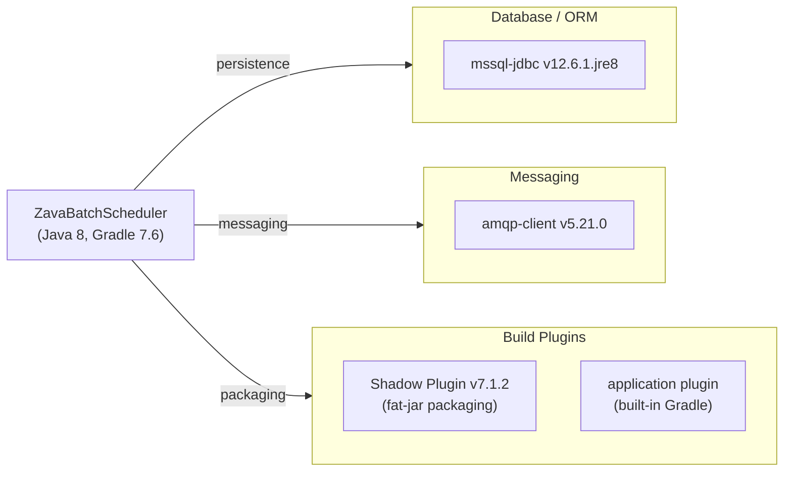

# Dependency Map

ZavaBatchScheduler declares 2 external runtime dependencies managed by Gradle 7.6, plus the Shadow plugin for fat-jar packaging — a very lean dependency footprint for a targeted batch scheduler.

## Dependencies

### Dependency Summary

| Category | Count | Key Libraries | Notes |
|----------|-------|---------------|-------|
| Database / ORM | 1 | mssql-jdbc 12.6.1.jre8 | Microsoft JDBC driver for SQL Server; `.jre8` variant targets Java 8 |
| Messaging | 1 | amqp-client 5.21.0 | RabbitMQ Java client; declared but not exercised in current source |
| Build Plugins | 2 | Shadow 7.1.2, Gradle application plugin | Shadow produces the self-contained uber-jar used in Docker |

### Version & Compatibility Risks

`mssql-jdbc:12.6.1.jre8` is a current and actively maintained release; however, the `.jre8` classifier will need to change to `.jre11` or `.jre17` once the application is upgraded off Java 8. `amqp-client:5.21.0` is the latest RabbitMQ Java client and is compatible with recent RabbitMQ brokers, but on Azure the natural migration target is **Azure Service Bus** with its `azure-messaging-servicebus` SDK, replacing the AMQP client entirely. The Shadow plugin `7.1.2` is incompatible with Gradle 8+ (the `convention` property was removed) — any Gradle upgrade must also migrate to Shadow `8.x` or switch to the `com.gradleup.shadow` fork.

### Notable Observations

- **RabbitMQ dependency is unused in source code**: `amqp-client` is declared as an `implementation` dependency but no AMQP-related code exists in `Main.java`. This is dead weight that increases the image attack surface without providing functionality.
- **No logging framework declared**: The application uses raw `System.out.println` for all output. There is no SLF4J, Logback, or Log4j dependency, making structured log ingestion into Azure Monitor/Application Insights difficult without refactoring.
- **No HTTP client library**: HTTP calls rely solely on the JDK built-in `java.net.HttpURLConnection`. There is no Retrofit, Apache HttpClient, or OkHttp declared, meaning retry logic, timeouts, and resilience patterns must be implemented manually.
- **Shadow plugin/Gradle version mismatch risk**: Shadow 7.1.2 uses the deprecated Gradle `convention` API removed in Gradle 8/9, so upgrading the build toolchain requires a simultaneous Shadow plugin upgrade to `8.x`.

## Test Dependencies

No test-scoped dependencies detected.

Total test-scope dependencies: 0

No test framework (JUnit, Mockito, AssertJ, etc.) is declared in `build.gradle`. The project currently has no automated unit or integration test coverage, which is a significant gap to address before cloud migration.
