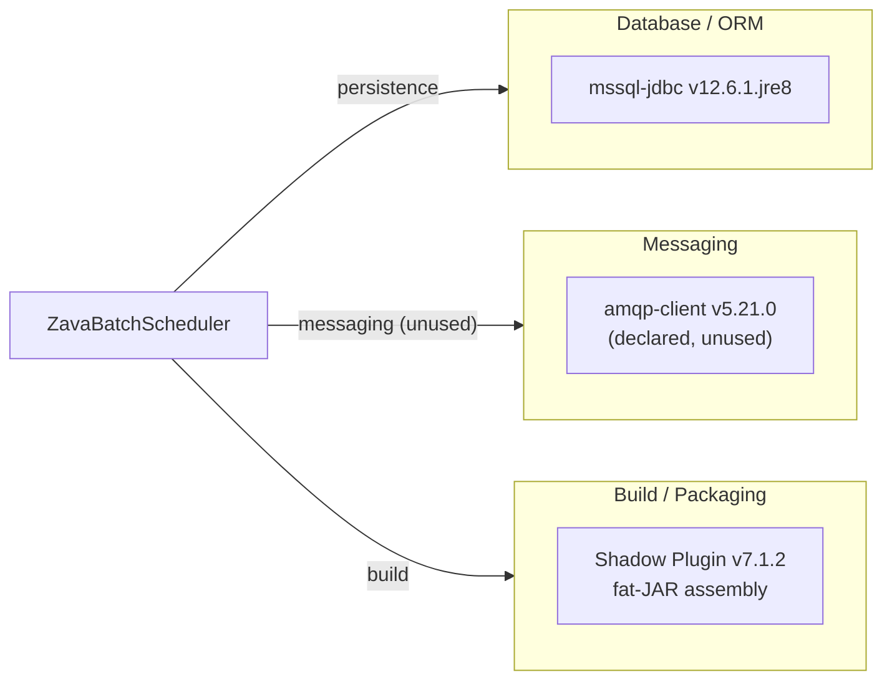

# Dependency Map

ZavaBatchScheduler declares 3 external dependencies (2 runtime, 1 build plugin) in `build.gradle`, making it a minimal-dependency Java application.

## Dependencies

### Dependency Summary

| Category | Count | Key Libraries | Notes |
|----------|-------|---------------|-------|
| Database / ORM | 1 | Microsoft JDBC Driver for SQL Server 12.6.1.jre8 | Direct JDBC, no ORM |
| Messaging | 1 | RabbitMQ amqp-client 5.21.0 | Declared as `implementation` but never imported or used |
| Build / Packaging | 1 | Shadow plugin 7.1.2 | Produces self-contained fat JAR (`*-all.jar`) |

### Version & Compatibility Risks

**Java 8 target is the primary risk.** The JVM target (`sourceCompatibility = 1.8`) is below the Java 17 LTS baseline required by many current Azure and Spring libraries. The `mssql-jdbc 12.6.1.jre8` variant is compiled for Java 8 and is technically current (released 2024), but the `.jre8` classifier will eventually be retired in favour of `.jre11`/`.jre17` builds. The Shadow plugin 7.1.2 is incompatible with Gradle 8 or higher due to the removed `Convention` API; upgrading Gradle without first upgrading Shadow will break the build. The `amqp-client 5.21.0` library is current but represents unused surface area that increases the fat-JAR size and introduces transitive dependencies unnecessarily.

### Notable Observations

- **No web or scheduling framework**: The application relies entirely on JDK built-in classes (`ScheduledExecutorService`, `HttpURLConnection`), which keeps the dependency tree minimal but sacrifices cloud-native features such as health endpoints, structured logging, and metrics.
- **Unused dependency increases attack surface**: `com.rabbitmq:amqp-client:5.21.0` is declared but never used. Every unused library is a potential CVE vector; it should be removed.
- **No logging framework declared**: There is no SLF4J, Logback, or Log4j2 dependency; log output goes to `System.out`. This prevents integration with Azure Monitor and structured log querying.
- **Fat-JAR packaging without multi-stage layer optimization**: The Shadow plugin produces a single monolithic JAR. For container deployments (AKS, Container Apps) it is more efficient to use layered JARs or Spring Boot's layertools to allow Docker to cache dependency layers separately.

## Test Dependencies

No test-scope dependencies declared.

Total test-scope dependencies: 0

No testing framework (JUnit, TestNG, Mockito) is configured in `build.gradle`. Adding unit tests would require at minimum JUnit 5 and Mockito as `testImplementation` dependencies.
