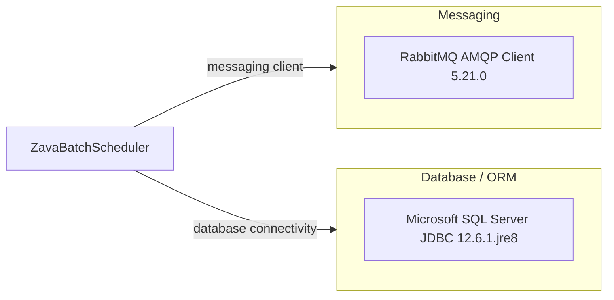

# Dependency Map

This project declares 2 runtime dependencies in Gradle, focused on messaging and SQL Server persistence.

## Dependencies

### Dependency Summary

| Category | Count | Key Libraries | Notes |
|---|---:|---|---|
| Messaging | 1 | com.rabbitmq:amqp-client:5.21.0 | Declared but not currently used in source flow |
| Database / ORM | 1 | com.microsoft.sqlserver:mssql-jdbc:12.6.1.jre8 | Used for JDBC writes to BatchRunLog |

### Version & Compatibility Risks

The project uses Java 8 with an older Shadow plugin line, and build execution on newer Gradle versions can fail due plugin compatibility. Dependency set is small, but versions should still be monitored for security advisories.

### Notable Observations

- No web framework dependency is declared; app is a scheduler process rather than an HTTP server.
- No dedicated logging framework dependency; logging uses `System.out`.
- No test-scoped dependencies were declared in `build.gradle`.

## Test Dependencies

| Framework | Version | Notes |
|---|---|---|
| None detected | N/A | No test dependencies declared |

Total test-scope dependencies: 0
No test dependencies detected.
